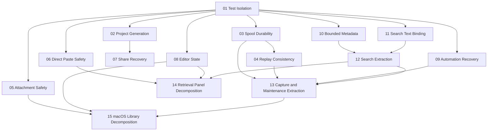

# Readability and Reliability Roadmap

## Goal

Improve Stow's data safety, failure recovery, test isolation, and code readability through small, independently reviewable pull requests.

Each linked plan is one PR-sized unit with its own scope, tests, and completion checklist. Merge reliability changes before structural refactors so behavior is protected before code moves.

## Working Principles

- Keep each PR focused on one failure mode or one structural boundary.
- Add regression coverage before or with each behavior change.
- Run only non-interactive checks during implementation.
- Run relevant UI tests once, as the final verification batch for a UI-affecting PR.
- Never invoke UI test schemes or `Scripts/ui_tests.sh` from CI.
- Merge plans in dependency order; parallelize only plans in the same wave that do not touch overlapping code.
- Delete a completed plan after its evidence is recorded here, replacing its plan link with the merged PR link.

## Status

| Status | Meaning |
| --- | --- |
| Planned | Scope is ready but implementation has not started. |
| In progress | One implementation PR is active. |
| Blocked | An explicit dependency or external condition prevents progress. |
| Complete | Completion checks passed and the PR merged. |

## Roadmap

### Wave 1 — Safe Development Foundation

These PRs make subsequent implementation and verification reproducible.

| Order | Status | Plan | Outcome |
| --- | --- | --- | --- |
| 01 | Planned | [App Storage Test Isolation](2026-09-12_01-app-storage-test-isolation-plan.md) | Unit tests cannot access or consume live Stow data. |
| 02 | Planned | [Project Generation Reproducibility](2026-09-12_02-project-generation-reproducibility-plan.md) | Xcode project generation is deterministic and CI-checkable. |

### Wave 2 — Durable Capture and Content Handling

Complete these before extracting capture responsibilities from `AppModel`.

| Order | Status | Plan | Outcome |
| --- | --- | --- | --- |
| 03 | Planned | [Capture Spool Durability](2026-09-12_03-capture-spool-durability-plan.md) | Recoverable failures remain retryable and staging is cross-process safe. |
| 04 | Planned | [Capture Replay Consistency](2026-09-12_04-capture-replay-consistency-plan.md) | Replay preserves newer metadata and intentional edits. |
| 05 | Planned | [Attachment Materialization Safety](2026-09-12_05-attachment-materialization-safety-plan.md) | Same-named attachments cannot overwrite each other. |

### Wave 3 — User-Action Safety and Recovery

Plans 06 and 08 can proceed after Plan 01. Plan 07 also depends on the reproducible project generator from Plan 02. All three should merge before the related view decomposition.

| Order | Status | Plan | Outcome |
| --- | --- | --- | --- |
| 06 | Planned | [Direct Paste Target Safety](2026-09-12_06-direct-paste-target-safety-plan.md) | Command-V is sent only to the validated target application. |
| 07 | Planned | [Share Capture Recovery](2026-09-12_07-share-capture-recovery-plan.md) | Share saves are retryable and staging has explicit lifecycle ownership. |
| 08 | Planned | [Editor Failure State](2026-09-12_08-editor-failure-state-plan.md) | Failed saves and dirty drafts remain visible and protected. |

### Wave 4 — Runtime and Input Edge Cases

These are focused reliability PRs with minimal overlap.

| Order | Status | Plan | Outcome |
| --- | --- | --- | --- |
| 09 | Planned | [Automation Transport Recovery](2026-09-12_09-automation-transport-recovery-plan.md) | In-process response failures recover without re-executing requests. |
| 10 | Planned | [Bounded Link Metadata Fetching](2026-09-12_10-bounded-link-metadata-plan.md) | Remote metadata cannot exceed memory limits while downloading. |
| 11 | Planned | [Search Index Text Binding](2026-09-12_11-search-index-text-binding-plan.md) | Embedded NUL content is indexed without truncation. |

### Wave 5 — Responsibility Extraction

Begin only after the affected reliability behavior is covered and merged.

| Order | Status | Plan | Outcome |
| --- | --- | --- | --- |
| 12 | Planned | [AppModel Search Extraction](2026-09-12_12-appmodel-search-extraction-plan.md) | Search ownership and async coordination move into a dedicated actor. |
| 13 | Planned | [AppModel Capture and Maintenance Extraction](2026-09-12_13-appmodel-capture-maintenance-extraction-plan.md) | `AppModel` becomes a smaller observable application-state adapter. |

### Wave 6 — View Decomposition

Keep these PRs behavior-neutral and merge them after reliability changes to minimize conflicts.

| Order | Status | Plan | Outcome |
| --- | --- | --- | --- |
| 14 | Planned | [Retrieval Panel Decomposition](2026-09-12_14-retrieval-panel-decomposition-plan.md) | Quick-panel state, rendering, and AppKit adapters have clear boundaries. |
| 15 | Planned | [macOS Library Decomposition](2026-09-12_15-mac-library-decomposition-plan.md) | Library presentation components become independently understandable. |

## Dependencies

## Completion Criteria

- All reliability plans have merged with regression tests for their original failure scenarios.
- `Scripts/ci.sh` passes and continues to exclude UI tests.
- Relevant UI-affecting PRs complete one final local UI verification batch after non-interactive checks.
- `AppModel`, Retrieval Panel, and macOS Library responsibilities are separated without user-visible regressions.
- Project generation is deterministic and a clean checkout passes its non-mutating drift check.
- Every completed plan is replaced in this roadmap by its merged PR link and completion evidence.
