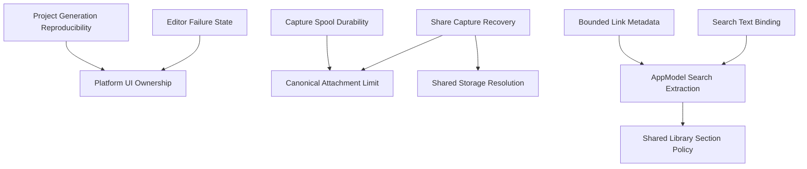

# Behavior-Preserving Simplifications Plan

## Goal

Reduce independent implementations of search coordination, capture limits, Library collection rules, shared-container resolution, and platform UI ownership without changing user-visible behavior, persisted data, CLI output, search semantics, or platform support.

## Context

The repository review confirmed five simplification opportunities:

- `AppModel` independently coordinates index freshness for Library, retrieval-panel, and automation searches.
- The 100 MiB attachment limit is repeated across core validation, spool replay, clipboard capture, and share capture.
- iOS and macOS independently define membership and ordering for the same Library sections.
- Host, extension, CLI, and simulator settings independently reconstruct shared-container paths.
- The Xcode generator compiles all `StowApp/Shared` files into both apps even though the iOS Library and Settings screens have no macOS runtime callers.

Search extraction is already specified by `2026-09-12_12-appmodel-search-extraction-plan.md`. This plan references that work instead of creating a competing design. Project source-membership changes depend on the non-destructive generator work in `2026-09-12_02-project-generation-reproducibility-plan.md`.

## Architecture

Keep each shared concept narrow and domain-owned:

- A search coordinator owns index freshness and atomic rebuild-then-query behavior; views retain debounce, cancellation, and presentation state.
- `StowCore` owns the attachment-byte limit and shared-storage location rules.
- `StowSection` owns cross-platform Library membership and default ordering; macOS-specific labels and batch actions remain in `MacLibraryPolicy`.
- iOS-only screens belong to the iOS target. Only presentation helpers used by both apps remain shared.

Do not add a generic service locator, generic filtering framework, general filesystem abstraction, or cross-feature utility layer.

## Dependencies

- Complete the existing prerequisite plans before changes that overlap their files.
- Deliver each section below as an independently reviewable PR; do not combine all simplifications into one change.

## Non-Goals

- Do not change search syntax, ranking, filters, debounce intervals, limits, or error messages.
- Do not change attachment acceptance boundaries or clipboard-representation limits.
- Do not change Library section names, membership, counts, or ordering.
- Do not change App Group identifiers, entitlement checks, simulator paths, development overrides, or fallback locations.
- Do not redesign iOS or macOS views.
- Do not remove public `StowCore` APIs solely because the repository has no current caller.
- Do not run interactive UI tests until all implementation and non-interactive checks for the current PR are complete.

## Plan

### PR 1 — Canonical attachment capture limit

- [x] Add a domain-specific `CaptureLimits.maximumAttachmentBytes` in `StowCore` with the existing value `100 * 1_024 * 1_024`; acceptance: exact-boundary and one-byte-over tests use the constant and retain their current outcomes.
- [x] Replace repeated attachment-limit literals in `CaptureDraft`, `CaptureSpool`, `AttachmentStore`, `ClipboardMonitor`, and `ShareCaptureModel`; acceptance: repository search finds no independent 100 MiB attachment literal outside tests and documentation.
- [x] Keep `StowRepresentationLimits` independent because preserved clipboard representations are a separate policy; acceptance: representation-limit tests remain unchanged and pass.
- [x] Run `DEVELOPER_DIR=/Applications/Xcode.app/Contents/Developer swift test --package-path Packages/StowCore --filter PerformanceReliabilityTests` and `--filter CaptureSpoolTests`; acceptance: both pass.
- [x] Run both app builds so clipboard and share-extension call sites compile; acceptance: macOS and iOS simulator builds pass.

### PR 2 — Shared-container resolution ownership

- [x] Add narrowly scoped cross-platform container and simulator-root helpers to `StowSharedStorage`; acceptance: tests cover simulator UDID layout, explicit development overrides, macOS entitlement fallback, and App Group selection inputs.
- [x] Delegate `StowEnvironment`, `ShareCaptureModel`, and `StowShareSettings` to the shared helpers while preserving the app's `--stow-shared-container-path` and CLI `STOW_SHARED_CONTAINER_PATH` behavior; acceptance: no duplicated `StowSimulatorAppGroup`, `StowDevelopmentAppGroup`, or App Group string remains in Swift call sites.
- [x] Keep process-specific policy explicit at the caller boundary rather than hiding command-line parsing in the storage helper; acceptance: the helper API takes resolved inputs and has deterministic unit tests.
- [x] Run `StowSharedStorageTests`, `StowShareSettingsTests`, both share-extension builds, and `Scripts/ci.sh`; acceptance: all pass.
- [x] After non-interactive checks, run `Scripts/ui_tests.sh ios-share` once; acceptance: confirmation and immediate-save sharing both pass as part of the final 14-test iOS UI suite.

### PR 3 — Search coordination

- [x] Execute `2026-09-12_12-appmodel-search-extraction-plan.md` after its listed reliability dependencies; acceptance: `AppModel` no longer owns `SQLiteSearchIndex` or the indexed fingerprint.
- [x] Use one item-revision representation for coordinator freshness and view task identities in `StowRootView`, `MacLibraryView`, and `RetrievalPanel`; acceptance: no view independently reimplements the item ID/`updatedAt` hash.
- [x] Preserve each UI caller's debounce, cancellation generation, metrics, query construction, and error presentation; acceptance: focused tests assert these caller-specific behaviors around the shared coordinator.
- [x] Run `SearchServiceTests`, `SearchIndexRecoveryTests`, and `StowAutomationHostServiceTests`; acceptance: all pass, including an interleaving test proving a query cannot run against the wrong document revision.

### PR 4 — Shared Library section policy

- [x] Move Inbox, Recent, Pinned, Archive, Trash, and Settings membership predicates to one shared `StowSection` policy; acceptance: `StowRootView` and `MacLibraryPolicy` both delegate to it.
- [x] Move default section ordering to the same policy while preserving Recently Used ordering and current newest-first behavior; acceptance: fixed-date tests cover every section and ordering tie behavior.
- [x] Keep macOS-only titles, subtitles, counts, empty states, and batch-action rules in `MacLibraryPolicy`; acceptance: the shared policy contains no macOS UI copy or SwiftUI types.
- [x] Extend `MacLibraryPresentationTests` with cross-platform section fixtures and run `StowAppTests`; acceptance: all 78 tests pass.

### PR 5 — Explicit platform UI ownership

- [x] Complete `2026-09-12_02-project-generation-reproducibility-plan.md` before changing target source membership; acceptance: `ruby Scripts/generate_project.rb --check` is non-destructive and passes from a clean tree.
- [x] Move `StowRootView`, `ItemCollectionView`, `StowItemDetailView`, and `StowSettingsView` to iOS-only target ownership; acceptance: the generated project includes them only in `Stow-iOS` and the macOS app has no replacement compatibility copy.
- [x] Move only genuinely cross-platform presentation helpers—item labels, preview text, and `SimpleSyntaxHighlighter`—to a focused shared file; acceptance: `MacLibraryView` and `RetrievalPanel` compile without importing iOS screen implementations.
- [x] Move `PanelDropTestTarget` to macOS debug support; acceptance: the macOS Library test seam remains available with no macOS declaration left in `StowRootView`.
- [x] Remove obsolete platform conditionals exposed by the move without changing view copy, accessibility identifiers, navigation, or actions; acceptance: the PR contains no intended UI behavior changes.
- [x] Run `ruby Scripts/generate_project.rb --check`, `StowAppTests`, macOS and iOS builds, and `Scripts/ci.sh`; acceptance: all pass and the generator leaves `git status` unchanged.
- [ ] After all non-interactive checks, run `Scripts/ui_tests.sh all` once; blocked: all 14 iOS UI tests pass, but macOS UI automation exits 77 because Developer Mode is disabled on the host.

## Risks

- Search coordination can change result timing even when result contents are unchanged. Preserve current debounce and cancellation at the UI adapter and test controlled interleavings.
- Storage resolution mistakes can separate extension writes from host reads. Assert exact URLs for every supported environment before replacing callers.
- Moving shared files can accidentally remove helper symbols from macOS. Inventory cross-platform symbol callers before changing target membership and require both builds before UI testing.
- Existing reliability plans overlap `CaptureSpool`, `ShareCaptureModel`, `StowItemDetailView`, and search files. Respect the dependency order to avoid combining behavior fixes with structural movement.

## Execution Evidence

- The implementation is split across dependency-ordered pull requests [#21](https://github.com/narumiruna/stow/pull/21) through [#31](https://github.com/narumiruna/stow/pull/31); no branch has been merged as part of this execution.
- `DEVELOPER_DIR=/Applications/Xcode.app/Contents/Developer Scripts/ci.sh` passed on the final implementation.
- `StowAppTests` passed 78 tests. The final iOS UI suite passed 14 tests, including both share-extension scenarios.
- `ruby Scripts/generate_project.rb --check` and `git diff --check` passed, and the generator check left `git status` unchanged.
- The only unavailable check is macOS UI automation: `Scripts/ui_tests.sh all` exits 77 because host Developer Mode is disabled. The script continued and the iOS suite passed after fixing its empty-argument handling under the system Bash.

## Completion Checklist

- [ ] All five PR-sized changes are merged in dependency order, or explicitly marked not applicable with evidence. Stacked branches are prepared for review but intentionally not merged.
- [x] Search freshness, attachment limits, Library membership, and shared-container paths each have one authoritative implementation.
- [x] The macOS target compiles only its active Library and Settings surfaces plus genuinely shared helpers.
- [x] No persisted model, migration plan, CLI JSON schema, CLI output, user-facing copy, accessibility identifier, or entitlement changes.
- [x] `DEVELOPER_DIR=/Applications/Xcode.app/Contents/Developer Scripts/ci.sh` passes without invoking UI tests.
- [ ] Required final UI batches pass only after non-interactive checks for their PRs. iOS passed; macOS is blocked by disabled Developer Mode.
- [x] `ruby Scripts/generate_project.rb --check` and `git diff --check` pass.
- [x] `git status --short` shows only the intended implementation and plan changes before review.
