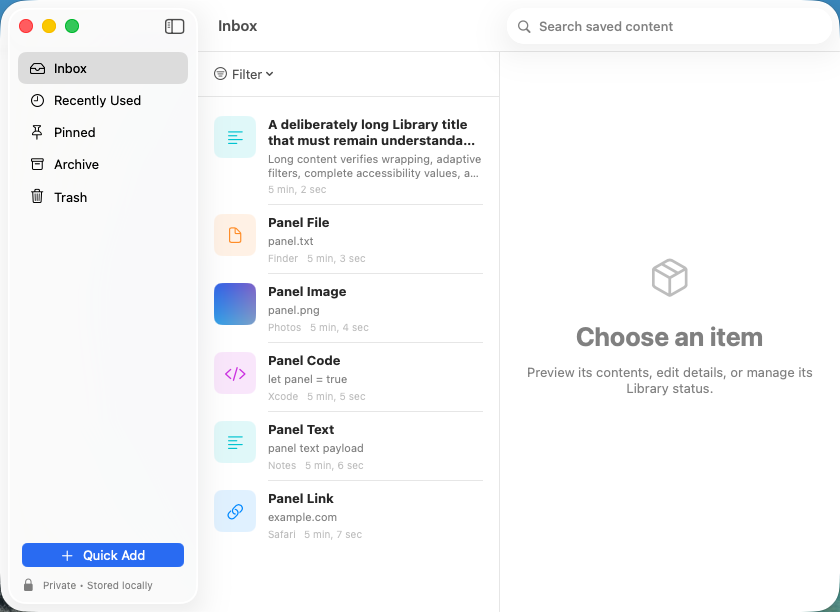
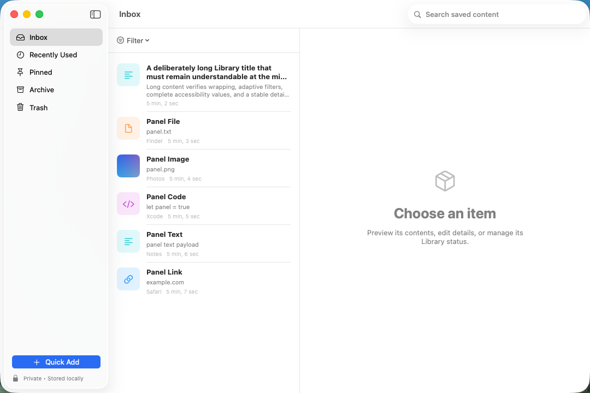
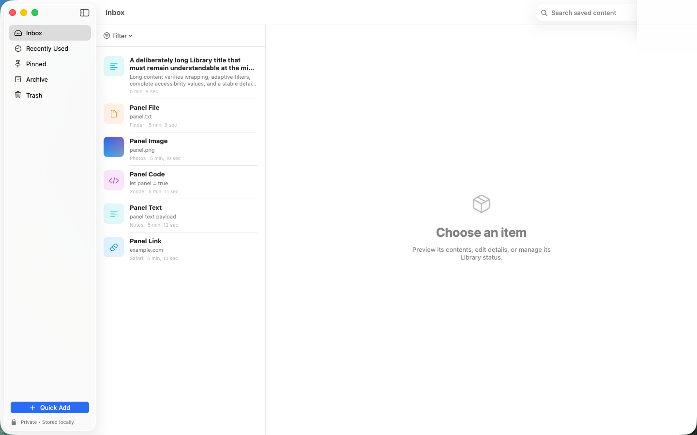
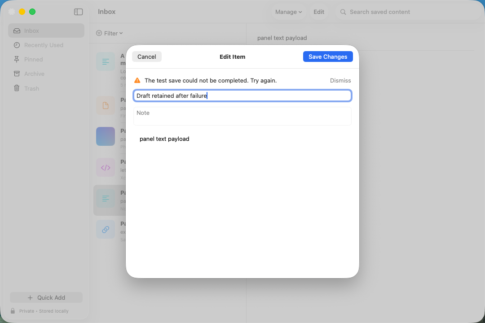
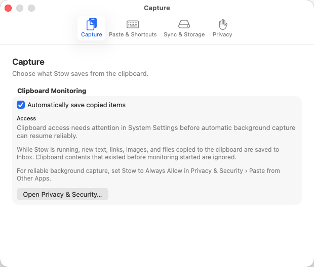
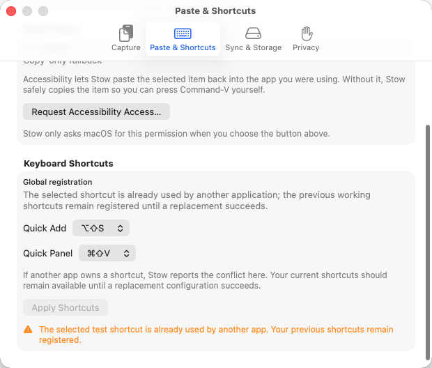
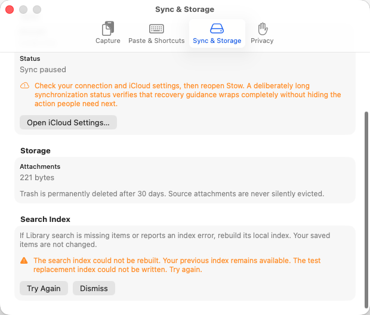
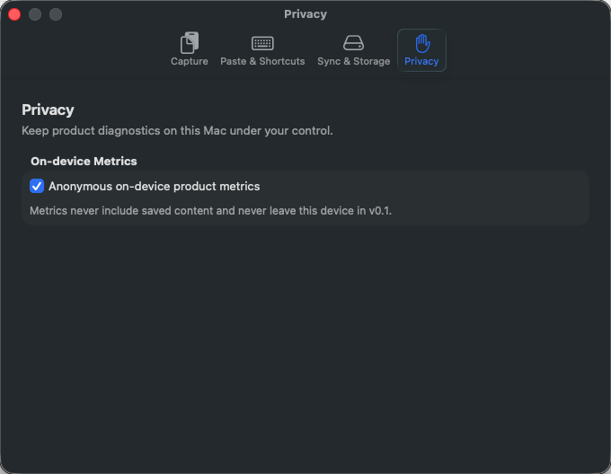

# Stow v0.1 Library and Settings Visual Review

- Scope: current single-display macOS host
- Source: final passing `StowMacUITests` batch
- Review status: Pending final screenshot extraction and inspection

## Library at supported widths

The Library keeps Inbox, Recently Used, Pinned, Archive, Trash, Filter, Quick Add, storage status, list content, and detail space within the window. The adaptive Filter control replaces the clipped three-picker row.

## Editing and recovery

Cancel and Save Changes remain distinct. A failed save retains the complete draft and previous saved item.

## Capture Settings

Clipboard status and recovery guidance wrap at the minimum Settings width without hiding the system-settings action.

## Paste and shortcut conflict

A rejected shortcut pair leaves the previous working configuration selected and registered. Conflict copy remains fully visible.

## Sync, storage, and search recovery

Paused sync guidance and failed search-index replacement provide local recovery while preserving offline Library use and the previous index.

## Appearance and accessibility preferences

Settings retains hierarchy and non-color state cues in Dark Mode with Increase Contrast and Reduce Motion.

## Inspection checklist

- [ ] No app-owned label, status, recovery message, or action is clipped, obscured, or ambiguously truncated.
- [ ] Long user content has an unambiguous bounded preview and a complete detail/Help/accessibility path.
- [ ] Filter, selection, Save, Cancel, Undo, Restore, permission, shortcut, and search-recovery states are distinguishable without color alone.
- [ ] The Library hierarchy remains stable at 840×560, 1080×720, and 1440×900.
- [ ] Settings pages remain usable at 620×500 and in the tested appearance preferences.
- [ ] Existing Quick Panel screenshots remain visually unchanged.
