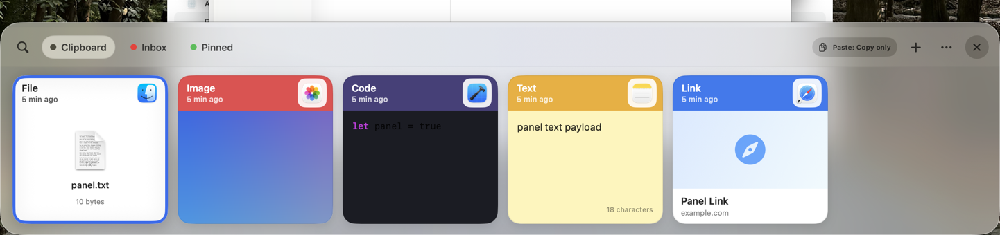
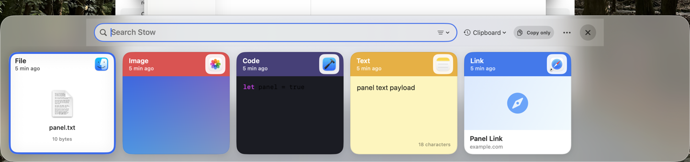
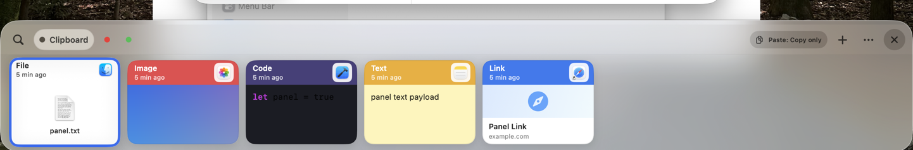
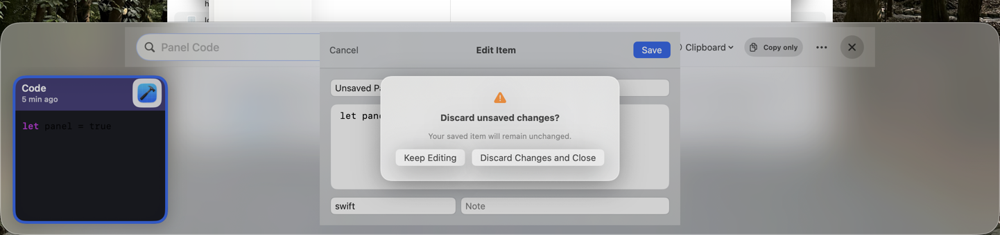
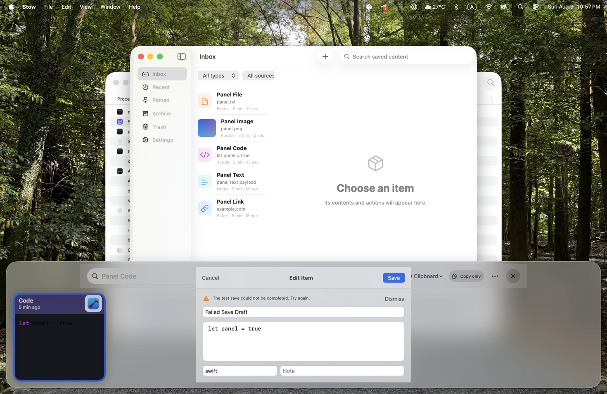
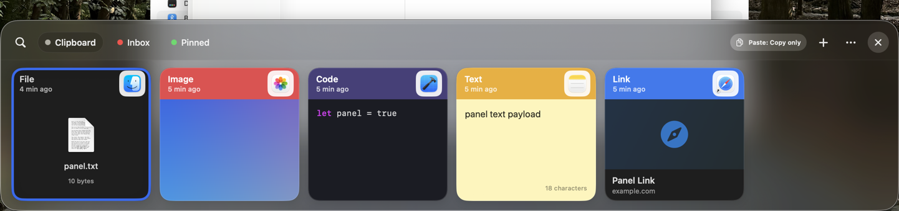
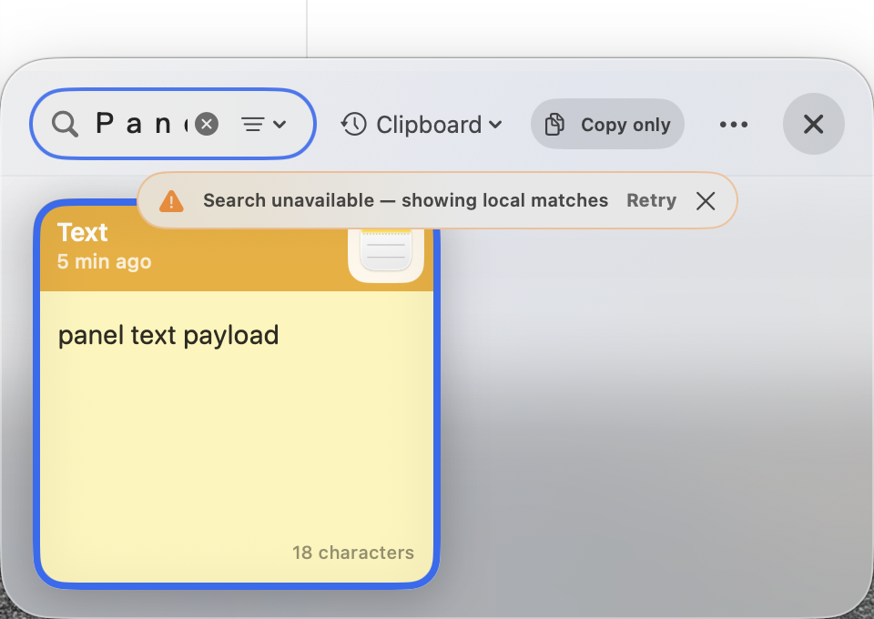
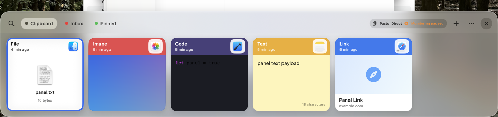

# Stow v0.1 Quick Panel Visual Review

- Captured: 2026-08-09 on macOS 26.5.2
- Source: passing 9-test `StowMacUITests` final batch (`/tmp/StowMacUITests-final.xcresult`)
- Review status: **Owner approval pending**

## Normal, light, and Copy-only

The normal light layout keeps Search, all primary collections, Copy-only status, Quick Add, More, and Close visible.

## Search

Search keeps the active Clipboard collection, Copy-only status, More, and Close visible.

## Compact

The compact-height layout retains the primary collections, status, and Close.

## Dirty-edit confirmation

The protected exit offers `Keep Editing` and a non-default `Discard Changes and Close` action while preserving the draft behind it.

## Save failure

A failed save keeps the exact draft editable and identifies the failed action inline.

## Dark appearance and Reduce Motion

## Narrow search error

At 480 pt content width, Search, the active collection, Copy-only status, More, and Close remain available; the failed search retains a local result and offers Retry.

## Increase Contrast, Direct Paste, and paused monitoring

The status capsule communicates both states with text and icons rather than color alone.

## Approval

- [ ] The owner approves the normal, compact, search, dirty-confirmation, error, light, dark, narrow, Copy-only, Direct Paste, paused-monitoring, Reduce Motion, and Increase Contrast presentations above.
